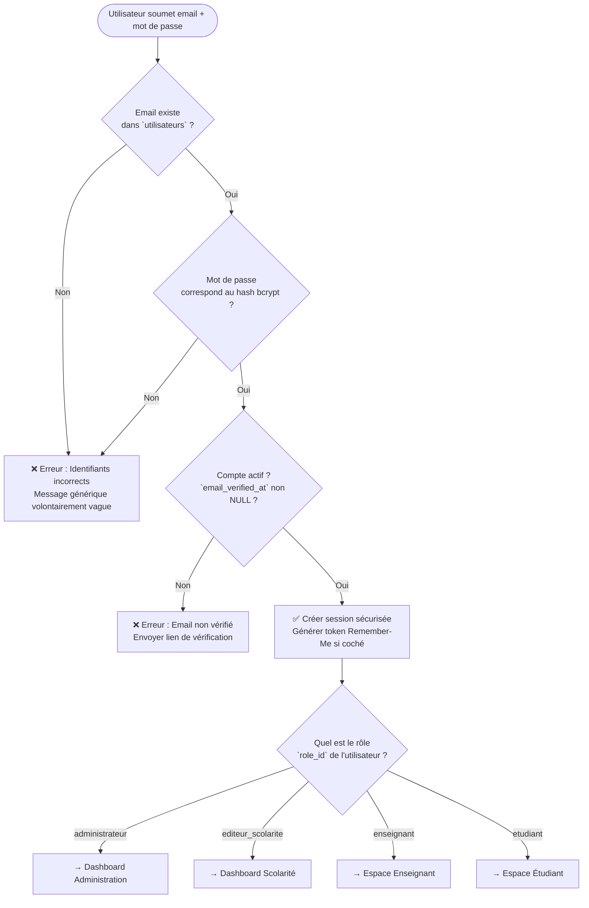
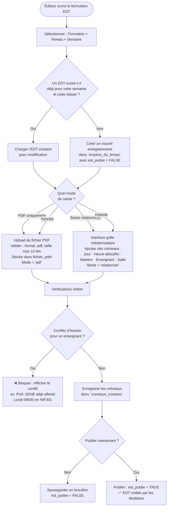
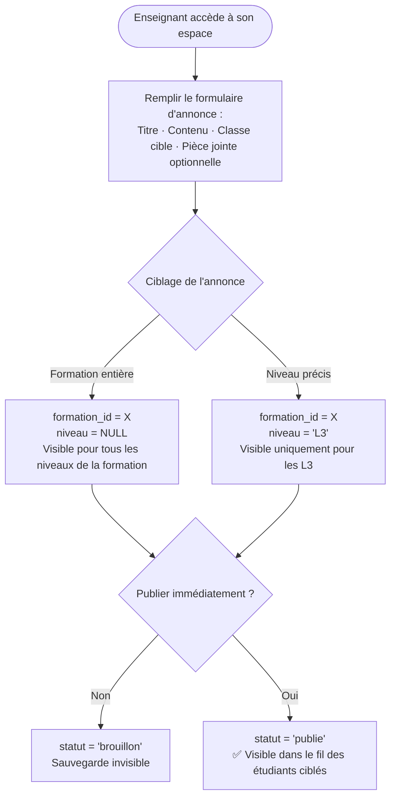
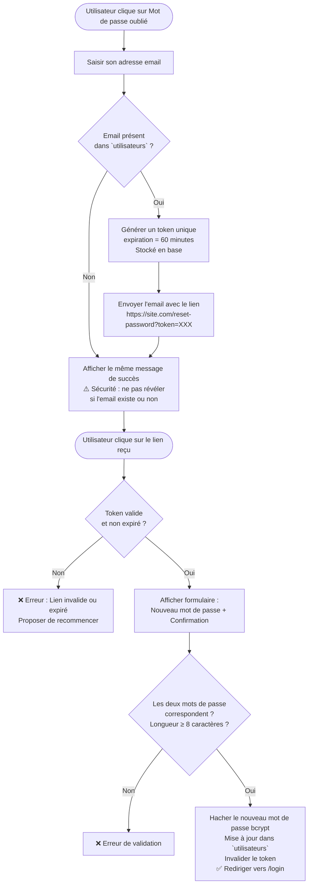

# Logique Applicative — Site Web UFR SATIC
## Université Alioune Diop de Bambey (UADB)

> **Document** : Architecture algorithmique et règles métier de l'application
> **Version** : 1.0 — Juin 2026
> **Projet** : Mémoire L3 D2A — Conception et mise en place du site web de l'UFR SATIC

---

## Table des matières

1. [Vue d'ensemble de l'architecture](#1-vue-densemble-de-larchitecture)
2. [Système d'authentification et de contrôle d'accès](#2-système-dauthentification-et-de-contrôle-daccès)
3. [Module : Gestion des emplois du temps](#3-module--gestion-des-emplois-du-temps)
4. [Module : Annonces pédagogiques](#4-module--annonces-pédagogiques)
5. [Module : Demandes administratives](#5-module--demandes-administratives)
6. [Module : Actualités et contenu public](#6-module--actualités-et-contenu-public)
7. [Module : Bibliothèque de documents](#7-module--bibliothèque-de-documents)
8. [Module : Formations (catalogue public)](#8-module--formations-catalogue-public)
9. [Règles de gestion transversales](#9-règles-de-gestion-transversales)
10. [Matrice des permissions par rôle](#10-matrice-des-permissions-par-rôle)

---

## 1. Vue d'ensemble de l'architecture

L'application suit une **architecture 3 couches** :

```
┌─────────────────────────────────────────────┐
│           COUCHE PRÉSENTATION               │
│  Front-end HTML/CSS/JS — Mobile First       │
│  Vues publiques + Espaces authentifiés      │
└──────────────────┬──────────────────────────┘
                   │ Requêtes HTTP / API REST
┌──────────────────▼──────────────────────────┐
│           COUCHE MÉTIER (Back-end)          │
│  Contrôleurs · Règles métier · Middlewares  │
│  Authentification · Autorisation (RBAC)     │
└──────────────────┬──────────────────────────┘
                   │ Requêtes SQL
┌──────────────────▼──────────────────────────┐
│           COUCHE DONNÉES (MySQL)            │
│  14 tables · Clés étrangères · Contraintes  │
│  Index d'optimisation · Intégrité référent. │
└─────────────────────────────────────────────┘
```

### Profils utilisateurs (Acteurs du système)

| Rôle | Accès | Description |
|---|---|---|
| **Visiteur public** | Non authentifié | Consulte les pages publiques (formations, actualités, contact) |
| **Étudiant** | Authentifié | Accède à son espace personnel (EDT, annonces, demandes admin.) |
| **Enseignant** | Authentifié | Publie des annonces, consulte son planning |
| **Éditeur scolarité** | Authentifié | Gère les emplois du temps et traite les demandes admin. |
| **Administrateur** | Authentifié | Contrôle complet de la plateforme |

---

## 2. Système d'authentification et de contrôle d'accès

### 2.1 Algorithme de connexion



### 2.2 Contrôle d'accès basé sur les rôles (RBAC)

Chaque requête vers une route protégée est interceptée par un **middleware d'autorisation** :

```
ALGORITHME : Vérification d'accès (Middleware)
────────────────────────────────────────────────
1. Extraire la session / le token de la requête HTTP
2. SI pas de session valide :
      → Rediriger vers /login  (HTTP 401)
3. Récupérer le rôle de l'utilisateur connecté
4. Vérifier que le rôle a la permission d'accéder à la route demandée
5. SI permission refusée :
      → Afficher page 403 Accès interdit
6. SI permission accordée :
      → Passer la requête au contrôleur concerné
```

> **Règle de sécurité** : Le principe du **moindre privilège** s'applique. Un étudiant ne peut jamais accéder aux routes d'un enseignant ou d'un administrateur, même en modifiant l'URL manuellement.

---

## 3. Module : Gestion des emplois du temps

> **Table principale** : `emplois_du_temps`
> **Tables liées** : `creneaux_horaires`, `matieres`, `formations`

Ce module fonctionne en **mode hybride** : l'administrateur/scolarité peut soit uploader un PDF prêt à l'emploi, soit saisir les créneaux heure par heure en base de données, soit faire les deux.

### 3.1 Flux de création d'un emploi du temps (Éditeur Scolarité)



### 3.2 Algorithme de consultation (Étudiant)

```
ALGORITHME : Afficher l'EDT de la semaine courante
────────────────────────────────────────────────────
ENTRÉE : formation_id et niveau de l'étudiant connecté

1. Calculer la date du lundi de la semaine en cours (date_debut_semaine)
2. Rechercher dans `emplois_du_temps` :
      WHERE formation_id = [formation de l'étudiant]
        AND niveau       = [niveau de l'étudiant]
        AND date_debut_semaine = [lundi calculé]
        AND est_publie   = TRUE
3. SI aucun EDT trouvé :
      → Afficher message : "L'emploi du temps de cette semaine n'est pas encore disponible."
4. SI EDT trouvé :
   a. SI mode = 'pdf' ou 'hybride' :
         → Afficher bouton [📥 Télécharger le PDF]
   b. SI mode = 'relationnel' ou 'hybride' :
         → Récupérer tous les créneaux dans `creneaux_horaires`
              WHERE edt_id = [id trouvé]
                AND est_annule = FALSE
         → Afficher la grille visuelle heure par heure
              (colonnes = jours, lignes = tranches horaires)
   c. SI un créneau a est_annule = TRUE :
         → Afficher le créneau en grisé avec le motif d'annulation
```

### 3.3 Règles métier critiques des créneaux horaires

| Règle | Description | Niveau |
|---|---|---|
| **Anti-chevauchement enseignant** | Un même enseignant ne peut avoir deux créneaux simultanés sur un même EDT | Bloquant |
| **Cohérence horaire** | `heure_fin` doit toujours être strictement supérieure à `heure_debut` | Bloquant (CHECK SQL) |
| **Unicité de l'EDT** | Un seul EDT par triplet `(formation_id, niveau, date_debut_semaine)` | Bloquant (UNIQUE KEY) |
| **Annulation douce** | Un créneau annulé n'est pas supprimé mais marqué `est_annule = TRUE` | Fonctionnel |
| **Publication contrôlée** | Un EDT en brouillon (`est_publie = FALSE`) est invisible pour les étudiants | Sécurité |

---

## 4. Module : Annonces pédagogiques

> **Table principale** : `annonces`
> **Acteurs** : Enseignants (création), Étudiants (lecture)

### 4.1 Flux de publication d'une annonce (Enseignant)



### 4.2 Algorithme de filtrage du fil d'annonces (Étudiant)

```
ALGORITHME : Construire le fil d'annonces personnalisé
───────────────────────────────────────────────────────
ENTRÉE : formation_id et niveau de l'étudiant connecté

SELECT * FROM annonces
WHERE statut = 'publie'
  AND formation_id = [formation de l'étudiant]
  AND (niveau = [niveau de l'étudiant] OR niveau IS NULL)
ORDER BY created_at DESC
LIMIT 20

→ Afficher les annonces avec : avatar de l'enseignant, date, pièce jointe si présente
→ Pagination : charger 20 annonces supplémentaires au scroll
```

---

## 5. Module : Demandes administratives

> **Table principale** : `demandes_administratives`
> **Acteurs** : Étudiant (soumet), Éditeur Scolarité (traite)

Ce module remplace le déplacement physique au secrétariat pour les documents courants.

### 5.1 Flux complet de traitement d'une demande

```mermaid
flowchart TD
    A([Étudiant connecté]) --> B[Choisir le type de document :\n• Attestation de scolarité\n• Relevé de notes\n• Certificat d'inscription]
    B --> C[Vérification automatique :\nNom · Matricule · Filière · Niveau\npré-remplis depuis le profil]
    C --> D[Étudiant confirme et soumet]
    D --> E[Création dans `demandes_administratives`\nstatut = 'en_attente'\ndate_demande = NOW]

    E --> F([Notification → Éditeur Scolarité])
    F --> G[Éditeur consulte la liste des demandes\nen_attente]
    G --> H[Éditeur ouvre le dossier]
    H --> I{Dossier complet\net valide ?}

    I -- Non --> J[statut = 'rejete'\nmotifs_rejet = [texte explicatif]\ndate_traitement = NOW\n❌ Notification à l'étudiant]

    I -- Oui --> K[statut = 'en_cours'\nGénération / upload du document PDF]
    K --> L[Attacher le PDF :\nfichier_reponse_path = [chemin]\nstatut = 'traite'\ndate_traitement = NOW\n✅ Notification à l'étudiant]

    L --> M([Étudiant reçoit notification])
    M --> N[Étudiant télécharge son document\ndepuis son espace personnel]
```

### 5.2 Règles métier des demandes

| État | Déclencheur | Action étudiant | Action scolarité |
|---|---|---|---|
| `en_attente` | Soumission par l'étudiant | Peut annuler si pas encore traité | Voir + traiter |
| `en_cours` | Prise en charge par la scolarité | Lecture seule | Uploader le PDF |
| `traite` | PDF disponible | Télécharger le document | Archiver |
| `rejete` | Dossier invalide | Lire le motif + soumettre à nouveau | — |

> **Règle** : Un étudiant ne peut avoir qu'**une demande active** (en_attente ou en_cours) par type de document à la fois. Une nouvelle demande du même type est bloquée tant que la précédente n'est pas traitée ou rejetée.

---

## 6. Module : Actualités et contenu public

> **Table principale** : `actualites`
> **Acteurs** : Administrateur / Éditeur (création), Tous (lecture)

### 6.1 Algorithme d'affichage de la page d'accueil

```
ALGORITHME : Construire la page d'accueil
───────────────────────────────────────────
1. Récupérer les actualités épinglées :
      SELECT * FROM actualites
      WHERE statut = 'publie' AND est_epinglee = TRUE
      ORDER BY created_at DESC
      LIMIT 3
      → Afficher en bandeau / hero section

2. Récupérer les actualités récentes :
      SELECT * FROM actualites
      WHERE statut = 'publie' AND est_epinglee = FALSE
      ORDER BY created_at DESC
      LIMIT 6
      → Afficher en grille de cartes

3. Récupérer les annonces des 7 derniers jours :
      SELECT * FROM annonces
      WHERE statut = 'publie'
        AND created_at >= DATE_SUB(NOW(), INTERVAL 7 DAY)
      ORDER BY created_at DESC
      LIMIT 5
      → Afficher dans le widget "Dernières annonces"

4. Récupérer les formations disponibles :
      SELECT * FROM formations
      ORDER BY diplome, nom
      → Afficher dans la section "Nos formations"
```

### 6.2 Règles de publication

- Une actualité créée est en `statut = 'brouillon'` par défaut — elle n'est **jamais visible** au public.
- Seul un administrateur ou éditeur peut passer le statut à `'publie'`.
- `est_epinglee = TRUE` réserve l'actualité pour la mise en avant sur la page d'accueil. Maximum recommandé : **3 épinglées simultanées**.

---

## 7. Module : Bibliothèque de documents

> **Table principale** : `documents`
> **Acteurs** : Administrateur / Éditeur (upload), Tous (téléchargement)

### 7.1 Algorithme d'upload et de validation d'un document

```
ALGORITHME : Dépôt d'un document administratif
────────────────────────────────────────────────
ENTRÉE : fichier, titre, catégorie

1. Valider le fichier :
   a. Extension autorisée ? (.pdf, .docx, .xlsx)   → Sinon : erreur
   b. Taille ≤ 5 Mo ?                               → Sinon : erreur
   c. Titre renseigné et non vide ?                 → Sinon : erreur

2. Générer un nom de fichier sécurisé :
   nom_sécurisé = [timestamp]_[slug(titre)].[extension]
   (Évite les collisions et les injections de noms de fichiers)

3. Déplacer le fichier vers le répertoire de stockage sécurisé
   (Répertoire non accessible directement via URL publique)

4. Créer l'enregistrement dans `documents` :
   titre, fichier_path, categorie, editeur_id = utilisateur_connecté

5. Retourner le lien de téléchargement signé (via contrôleur, pas accès direct)
```

---

## 8. Module : Formations (catalogue public)

> **Tables** : `formations`, `departements`, `matieres`
> **Visibilité** : 100% publique, sans authentification

### 8.1 Logique d'affichage du catalogue

```
ALGORITHME : Afficher le catalogue des formations
───────────────────────────────────────────────────
1. Récupérer toutes les formations avec leur département :
      SELECT f.*, d.nom AS departement_nom
      FROM formations f
      JOIN departements d ON f.departement_id = d.id
      ORDER BY f.diplome ASC, f.nom ASC

2. Appliquer les filtres si l'utilisateur les a sélectionnés :
      SI filtre diplome = 'Licence' → WHERE f.diplome = 'Licence'
      SI filtre diplome = 'Master'  → WHERE f.diplome = 'Master'

3. Afficher chaque formation en carte :
   [Diplôme] · [Nom] · [Durée] · [Département]
   Bouton → "Voir la fiche détaillée"

ALGORITHME : Afficher la fiche d'une formation
───────────────────────────────────────────────
ENTRÉE : id de la formation

1. Récupérer la formation : SELECT * FROM formations WHERE id = [id]
2. Récupérer les matières associées :
      SELECT * FROM matieres
      WHERE formation_id = [id]
      ORDER BY niveau ASC, intitule ASC
3. Regrouper les matières par niveau pour afficher le programme
   semestre par semestre (L1 → L2 → L3 ou M1 → M2)
4. Afficher : présentation · objectifs · programme · admission · débouchés
```

---

## 9. Règles de gestion transversales

### 9.1 Gestion des fichiers uploadés

```
RÈGLE GÉNÉRALE D'UPLOAD
─────────────────────────
• Tous les fichiers sont stockés côté serveur dans un répertoire protégé
• Aucun fichier n'est servi directement par une URL statique
• Chaque téléchargement passe par un contrôleur qui vérifie :
    1. L'utilisateur est-il authentifié ? (si fichier privé)
    2. L'utilisateur a-t-il le droit de voir ce fichier ?
    3. Le fichier existe-t-il bien sur le disque ?
• Les noms de fichiers sont toujours normalisés (slugifiés + timestamp)
  pour éviter les attaques par traversée de répertoire
```

### 9.2 Gestion de la navigation et du routage

| Route | Visibilité | Rôle requis |
|---|---|---|
| `/` | Publique | — |
| `/formations` | Publique | — |
| `/formations/{id}` | Publique | — |
| `/actualites` | Publique | — |
| `/contact` | Publique | — |
| `/login` | Publique | — |
| `/espace-etudiant/*` | Privée | `etudiant` |
| `/espace-enseignant/*` | Privée | `enseignant` |
| `/scolarite/*` | Privée | `editeur_scolarite` |
| `/admin/*` | Privée | `administrateur` |

### 9.3 Algorithme de réinitialisation de mot de passe



---

## 10. Matrice des permissions par rôle

| Action | Visiteur | Étudiant | Enseignant | Éditeur Scolarité | Admin |
|---|:---:|:---:|:---:|:---:|:---:|
| Voir les formations | ✅ | ✅ | ✅ | ✅ | ✅ |
| Voir les actualités | ✅ | ✅ | ✅ | ✅ | ✅ |
| Télécharger documents publics | ✅ | ✅ | ✅ | ✅ | ✅ |
| Consulter son EDT | ❌ | ✅ | ✅ | ✅ | ✅ |
| Soumettre une demande admin. | ❌ | ✅ | ❌ | ❌ | ✅ |
| Publier une annonce | ❌ | ❌ | ✅ | ❌ | ✅ |
| Créer / publier un EDT | ❌ | ❌ | ❌ | ✅ | ✅ |
| Traiter les demandes admin. | ❌ | ❌ | ❌ | ✅ | ✅ |
| Uploader des documents | ❌ | ❌ | ❌ | ✅ | ✅ |
| Gérer les actualités | ❌ | ❌ | ❌ | ✅ | ✅ |
| Gérer les utilisateurs | ❌ | ❌ | ❌ | ❌ | ✅ |
| Gérer les formations | ❌ | ❌ | ❌ | ❌ | ✅ |
| Gérer les matières | ❌ | ❌ | ❌ | ❌ | ✅ |
| Accéder aux paramètres site | ❌ | ❌ | ❌ | ❌ | ✅ |

---

> **Note de conception** : Ce document décrit la logique de la version V1 de l'application. Les fonctionnalités avancées (notifications push, chatbot, mode hors-ligne PWA, moteur de recherche interne) sont identifiées pour une version V2 et ne font pas partie du périmètre de ce mémoire.

---

*Dernière mise à jour : Juin 2026*
